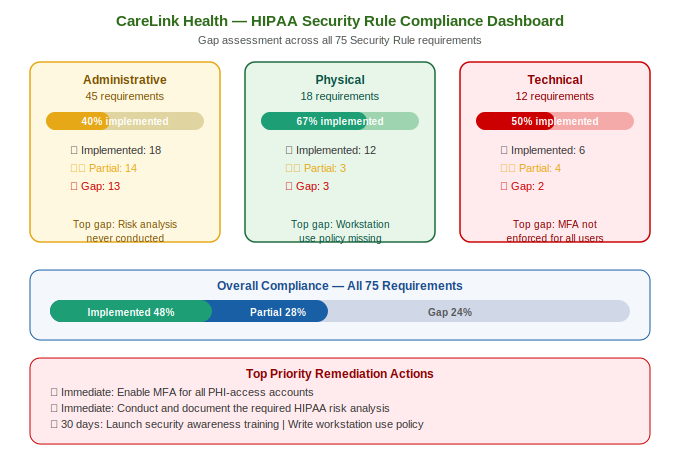

# CareLink Health — HIPAA Security Rule Compliance Project

---

## About This Project

This project demonstrates a full **HIPAA Security Rule** compliance
assessment and remediation programme for CareLink Health — a fictional
telehealth platform providing virtual GP consultations and remote
patient monitoring to 25,000 patients across three US states.

The project produces a gap assessment, risk analysis, remediation plan,
and Business Associate Agreement template.

> All names, data, and scenarios are fictional. Created for portfolio
> and learning purposes only.

---

## About CareLink Health

CareLink Health is a fictional US telehealth company founded in 2021.
It provides video GP consultations, remote patient monitoring, and
electronic prescription services. It processes and stores PHI for
approximately 25,000 active patients.

| Field | Value |
|-------|-------|
| Organisation | CareLink Health |
| Type | Telehealth platform |
| Founded | 2021 (fictional) |
| States | California, Texas, New York |
| Patients | ~25,000 active |
| Staff | 120 employees |
| Data | PHI — consultations, prescriptions, monitoring data |
| Covered Entity Type | Healthcare provider |
| Business Associates | Cloud hosting, billing processor, EHR vendor |

---

## What is the HIPAA Security Rule?

The Health Insurance Portability and Accountability Act (HIPAA)
Security Rule requires covered healthcare entities and their business
associates to implement specific safeguards to protect electronic PHI.

The Security Rule has three safeguard categories:

| Category | What it covers |
|----------|---------------|
| Administrative safeguards | Policies, training, risk analysis, access management |
| Physical safeguards | Facility access, workstation security, device disposal |
| Technical safeguards | Access control, audit controls, encryption, authentication |

---

## Project Documents

| File | Description |
|------|-------------|
| [README.md](README.md) | This file — project overview |
| [hipaa-risk-analysis.md](hipaa-risk-analysis.md) | Required HIPAA risk analysis document |
| [gap-assessment.md](gap-assessment.md) | Assessment of all 75 Security Rule requirements |
| [baa-template.md](baa-template.md) | Business Associate Agreement template |

---

## HIPAA Gap Assessment Summary

All 75 HIPAA Security Rule requirements were assessed across the
three safeguard categories.

### Administrative Safeguards

| Requirement | Status | Gap |
|-------------|--------|-----|
| Security management process | Partial | No formal risk management programme |
| Assigned security responsibility | Implemented | HIPAA Privacy Officer appointed |
| Workforce security | Partial | No consistent background check process |
| Information access management | Partial | Access reviews not conducted regularly |
| Security awareness training | Gap | No annual training programme |
| Security incident procedures | Partial | Procedures exist but not tested |
| Contingency plan | Gap | No formal BCP or DRP |
| Evaluation | Gap | No periodic technical evaluation |
| BAA requirements | Implemented | BAAs in place for three business associates |

### Physical Safeguards

| Requirement | Status | Gap |
|-------------|--------|-----|
| Facility access controls | Implemented | Office access controlled with key fobs |
| Workstation use policy | Gap | No formal workstation use policy |
| Workstation security | Partial | Some workstations not locked when unattended |
| Device and media controls | Gap | No formal device disposal procedure |

### Technical Safeguards

| Requirement | Status | Gap |
|-------------|--------|-----|
| Access control | Partial | Unique user IDs exist. No automatic logoff on all systems. |
| Audit controls | Partial | Logging enabled but not reviewed regularly |
| Integrity controls | Implemented | Data integrity checks in place |
| Person or entity authentication | Gap | MFA not enabled for all PHI-access accounts |
| Transmission security | Implemented | All PHI transmitted over TLS 1.2+ |

---

## Overall Compliance Status

| Category | Implemented | Partial | Gap |
|----------|------------|---------|-----|
| Administrative (45 reqs) | 18 | 14 | 13 |
| Physical (18 reqs) | 12 | 3 | 3 |
| Technical (12 reqs) | 6 | 4 | 2 |
| **Total (75 reqs)** | **36 (48%)** | **21 (28%)** | **18 (24%)** |

---

## HIPAA Risk Analysis Summary

The required HIPAA risk analysis identified the following
top risks to ePHI:

| Risk | Likelihood | Impact | Level |
|------|-----------|--------|-------|
| Unauthorised access to patient consultation recordings | High | High | CRITICAL |
| Ransomware encrypting patient PHI | High | High | CRITICAL |
| Staff member emailing PHI to wrong recipient | High | Moderate | HIGH |
| Lost or stolen staff laptop containing PHI | Moderate | High | HIGH |
| Business associate data breach | Moderate | High | HIGH |
| Unencrypted PHI on personal devices | Moderate | Moderate | MODERATE |

---

## Remediation Priorities

### Immediate (within 30 days)
- Enable MFA for all accounts with access to PHI
- Implement automatic workstation logoff after 10 minutes
- Conduct emergency security awareness session for all staff

### Short-term (within 90 days)
- Launch formal annual security awareness training programme
- Write and approve workstation use policy
- Establish monthly audit log review process
- Write device disposal procedure and secure wipe process

### Medium-term (within 6 months)
- Conduct and document formal risk analysis annually
- Write and test Business Continuity Plan
- Conduct first tabletop exercise for PHI breach scenario
- Implement formal access review process (quarterly)

---

## Business Associate Agreements

CareLink Health has three business associates that handle ePHI.
Each requires a signed BAA confirming their HIPAA obligations.

| Business Associate | Service | BAA Status |
|-------------------|---------|-----------|
| CloudBase Inc | Cloud hosting for patient data | Signed — current |
| BillPro Health | Insurance billing processing | Signed — current |
| MedRecord Systems | EHR platform vendor | Signed — requires annual review |

---

## Document Version History

| Version | Date | Author | Changes |
|---------|------|--------|---------|
| 1.0 | 2025 | Portfolio Author | Initial HIPAA compliance assessment completed |

---

*This document is part of a GRC portfolio project. All names,
data, and scenarios are fictional and used for learning and
career development purposes only.*

